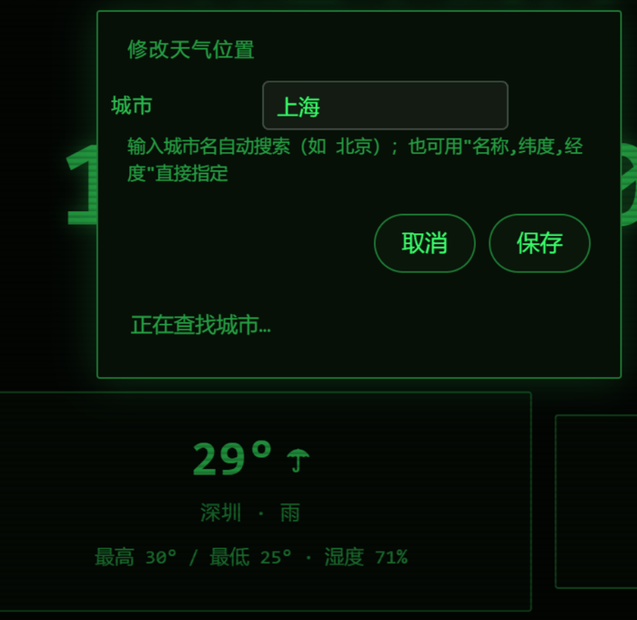
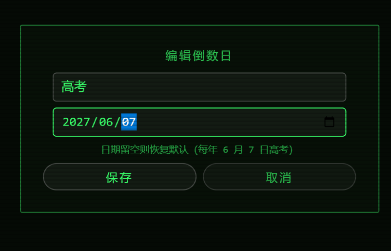

# 🌸 Banban Launcher · 班班启动器


> 一个为电子班牌设计的启动器 (๑•̀ㅂ•́)و✧
>
> 把教室里的 Android 电子班牌变成一块「会呼吸」的班级主页：漂亮的待机界面、
> 一键打开任意应用、还能看天气～ 内嵌 Crosswalk 内核，从 Android 5.1 到
> Android 5-14 的班牌都能跑得动哦！

| 主页 | 应用列表 | 天气·改位置 |
|:---:|:---:|:---:|
|  |  |  |

| 主题菜单 | 倒数日 |
|:---:|:---:|
|  |  |

## ✨ Features

- 🎨 **11 套主题随心换** — Apple、科技、可爱、MD3、鎏金、水墨、赛博、极光、蒸汽波、像素、街机，还有「自动换装」模式定时轮换
- 🕐 **班级信息看板** — 大时钟、问候语、自定义标语、一言 (Hitokoto)、倒数日，待机时就是一块好看的班级屏
- 📱 **应用启动器** — 右下角 ▦ 按钮，弹出跟随当前主题的垂直应用列表（图标 + 名称 + 拼音排序），点击即可打开任何带桌面入口的应用
- ⛅ **天气卡片** — Open-Meteo 免密钥 API，30 分钟缓存 + 三级降级（实时 → 过期缓存 → 占位文案），断网也不尴尬
- 📍 **长按改位置** — 长按天气卡片就能改城市，输入城市名自动地理编码，也支持「名称，纬度，经度」直填
- 💬 **长按换一言类型** — 长按一言卡片弹出类型选择，点选即生效：动画 / 漫画 / 游戏 / 文学 / 原创 / 来自网络 / 其他 / 影视 / 诗词 / 网易云 / 哲学 / 抖机灵（上游 `v1.hitokoto.cn` 的 a~l 全类型），或选「全部随机」
- 🙈 **隐藏应用 + 密码锁** — 长按列表里的应用即可隐藏它；长按右下角 ▦ 按钮，用**内置数字键盘**输入密码就能进入管理模式显示/恢复隐藏项。密码可随时开关与修改（设置 → 隐私）；忘了也不怕，隐私页长按「修改」3 秒即可清除密码；隐藏后 5 秒内还能一键「撤销」
- ⚙️ **设置面板分类** — 顶栏「设置」按钮里分三类：主题、文字、隐私，各自独立滚动
- 🔁 **开机自启 + 看门狗** — BootReceiver 开机拉起，Watchdog 定时保活，还有 HOME 类别注册，可以设成系统桌面
- 🧓 **老设备友好** — 内嵌 Crosswalk 23（Chromium 53）渲染页面，不依赖系统 WebView，Android 5.1 的班牌也能有现代网页体验

## 🛠️ 具体实现

整体是一个「原生壳 + 单页应用」的结构：

```
┌─────────────────────────────────────────────┐
│  app/src/main/assets/index.html  （全部 UI） │
│  11 套主题 · 启动器面板 · 天气卡片 · 纯 ES5    │
└──────────────────┬──────────────────────────┘
                   │ window.BanbanApp / banbanx:// scheme
┌──────────────────┴──────────────────────────┐
│  XWalkView (Crosswalk 23, armeabi-v7a)       │
│  MainActivity / MainApplication              │
├─────────────────────────────────────────────┤
│  AppBridge    应用列表 + 启动（双通道）        │
│  Watchdog     进程保活                        │
│  BootReceiver 开机自启                        │
└─────────────────────────────────────────────┘
```

**🌟 应用启动器的双通道兜底**（本项目最有趣的坑！）

部分 Android 5.1 设备上 `addJavascriptInterface` 注入的桥「对象在、方法不在」，
于是启动器做了双保险：

1. **主通道**：JS 桥 `window.BanbanApp` —— `getApps()` 返回应用列表 JSON（图标转
   64px PNG dataURL），`launch(pkg)` 直接启动；
2. **兜底通道**：页面加载完成后，原生用 `evaluateJavascript` 主动把列表 JSON 注入
   `window.__BANBAN_APPS`；点击应用时若桥不可用，改走 `banbanx://launch?p=包名`
   自定义 scheme，由 `XWalkResourceClient.shouldOverrideUrlLoading` 拦截启动。

页面端每次点击都会动态探测桥的可用性（校验方法存在，防「坏桥」），两条路哪条通走哪条～

**❄️ 天气的三级降级**：请求结果缓存 30 分钟；请求失败先试过期缓存（标注「非实时」），
再不行就显示占位文案。城市经纬度支持 Open-Meteo Geocoding 按名称解析，
保存到 `localStorage`，重启不丢。注意 API 走 http 明文——老班牌系统证书库过旧，
https 握手会失败，Manifest 已开 `usesCleartextTraffic` 豁免。

**👵 老内核兼容**：页面全部 ES5 写法（无箭头函数 / let / 模板字符串），
主题切换靠 CSS 变量 + class 组合，老 Chromium 也能丝滑过渡。

## 📦 获取依赖（重要！）

Crosswalk 官方早已停更下架，以下两个二进制需要自己准备（因体积与许可原因未入库）：

1. **Crosswalk AAR（4MB）** → 放到 `app/libs/xwalk_core_library-23.53.589.4-v7a.aar`
   - 从 [Crosswalk 存档仓库](https://github.com/nviswanathan/xwalk_core_library) 下载
     `xwalk_core_library-23.53.589.4.aar`；
   - 它是老式 `jni/` 布局，现代 AGP 不认，需要重打包：把 zip 内
     `jni/armeabi-v7a/*` 移到 `lib/`，删掉 `jni/` 与 `jni/x86/`，改回 `.aar` 后缀。

2. **内核 so（37MB）** → 放到 `app/src/main/jniLibs/armeabi-v7a/`
   - `libxwalkcore.so` 与 `libxwalkdummy.so` 就在上一步 AAR 的 `jni/armeabi-v7a/` 里，
     解出来放进去即可。

放好之后目录长这样：

```
banban-launcher/
├── app/
│   ├── libs/
│   │   └── xwalk_core_library-23.53.589.4-v7a.aar   ← 自己放
│   └── src/main/jniLibs/armeabi-v7a/
│       ├── libxwalkcore.so                          ← 自己放
│       └── libxwalkdummy.so                         ← 自己放
├── build.gradle
├── settings.gradle
└── gradle.properties
```

## 🔨 如何编译

需要 JDK 17 + Android SDK（compileSdk 34）。想省事可以用 Android Studio 直接打开。

```bash
# 1) 本机 SDK 路径（Windows 示例）
echo sdk.dir=C\:\\Android\\Sdk > local.properties

# 2) 编译 release APK
gradle assembleRelease
# 产物在 app/build/outputs/apk/release/app-release.apk
```

说明小贴士 ٩(ˊᗜˋ*)و

- 项目**不含签名密钥与口令**：想在 release 包上签自己的名，把
  `keystore.properties.example` 复制为 `keystore.properties`，填上你的
  keystore 文件名与口令即可（该文件已被 .gitignore 排除，放心填）；
  不配置的话会产出未签名 APK，装不上时可用 debug 变体：`gradle assembleDebug`
- 强制 `abiFilters 'armeabi-v7a'`：内嵌内核只有 32 位 so，
  64 位设备上进程必须以 v7a 运行才能加载它，这是有意为之哦
- `useLegacyPackaging = true`：Android 5.x 的 PackageManager 只认
  `extractNativeLibs=true` 的 so 解压安装

改页面不想上机也能验证一下下 ٩(ˊᗜˋ*)و 仓库里带了 jsdom 冒烟脚本，
99 项断言覆盖启动器双通道、天气位置编辑、一言类型选择、触屏 tap 判定、
应用隐藏与密码锁（含忘记密码自救）、设置分类切换、返回键关弹层、隐藏撤销、「隐藏需密码」开关（含"慢起手滚动不许误开应用""滑动不许误弹隐藏确认"
这类专治误触的回归）：

```bash
npm i jsdom
node tools/smoke.js app/src/main/assets/index.html
# 输出 ALL PASS 就说明主流程没被改坏
```

## 📲 安装到班牌

```bash
adb install -r app-release.apk
```

装好后有两个小玩法：

- 打开应用 → 右下角 ▦ 就是启动器啦
- 在班牌系统设置里把它设为「桌面 / 主屏幕应用」，
  开机直达主页，按 HOME 键也不会跑掉～
  （配合 BootReceiver，断电重启也能自动回到班牌界面）

### ✅ 装机自检清单（照着点一遍就踏实了 ٩(ˊᗜˋ*)و）

| # | 操作 | 预期 |
|---|---|---|
| 1 | 打开应用 | 主页正常，右下角有 ▦ 按钮 |
| 2 | 点 ▦ | 弹出应用列表（跟随当前主题配色） |
| 3 | **慢慢往下抹**列表 | 列表滚动，**不会误开应用**（重点！） |
| 4 | 停稳后轻点某个应用 | 正常打开；按住不放则不会打开 |
| 5 | 长按列表里某个应用 | 弹「隐藏」确认 → 确定后它消失，5 秒内可点「撤销」 |
| 6 | 长按 ▦ 按钮 | 首次引导设置密码（4~8 位数字，内置键盘） |
| 7 | 再长按 ▦ 输密码 | 进入「应用列表 · 管理」，隐藏项带「已隐藏」可恢复 |
| 8 | 顶栏「设置」→ 隐私 | 密码锁开关、修改密码、隐藏数量、隐藏需密码开关 |
| 9 | 长按天气卡片 / 一言卡片 | 分别弹出改位置、选类型 |
| 10 | 弹层打开时按返回键 | 关掉最上层弹层；没有弹层时应用不退出 |

> 小贴士：万一忘了密码，**设置 → 隐私 → 长按「修改」3 秒**即可清除密码，
> 已隐藏的应用不受影响，不会把自己锁在外面。

## 📄 目录结构

```
banban-launcher/
├── app/src/main/
│   ├── assets/index.html        # 全部页面 UI（主题/启动器/天气）
│   ├── java/.../AppBridge.java      # 应用列表 + 启动桥（双通道）
│   ├── java/.../MainActivity.java   # XWalkView 全屏容器
│   ├── java/.../MainApplication.java
│   ├── java/.../Watchdog.java       # 保活
│   ├── java/.../BootReceiver.java   # 开机自启
│   └── AndroidManifest.xml      # HOME 类别注册
└── docs/                        # 截图
```

---

看到这里的你也要元气满满哦！ᕙ(⇀‸↼‶)ᕗ
